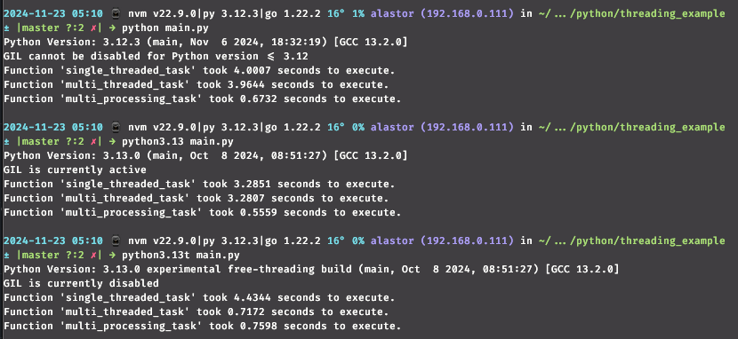

# How Impacting is GIL Example

## state of arts

El GIL (Global Interpreter Lock) es un mecanismo utilizado en el intérprete de Python, específicamente en CPython (la implementación más popular de Python). Su función principal es garantizar que solo un hilo de ejecución pueda ejecutar código Python a la vez, incluso en sistemas con múltiples núcleos de CPU.

¿Por qué existe el GIL?
El GIL facilita la gestión de memoria en Python, ya que muchas de sus estructuras internas (como el recolector de basura basado en referencia) no son seguras para el acceso concurrente. Al usar el GIL, Python evita conflictos entre hilos cuando acceden o modifican objetos compartidos.

Ventajas del GIL

- Simplifica la implementación: El manejo de memoria y los recursos compartidos son más simples y seguros gracias al GIL.
- Rendimiento en tareas de E/S: En programas que realizan muchas operaciones de entrada/salida (como leer archivos o realizar solicitudes de red), el impacto del GIL es mínimo porque otros hilos pueden ejecutarse mientras uno espera.

Desventajas del GIL

- Limitación en el rendimiento de CPU: En aplicaciones que realizan cálculos intensivos y quieren aprovechar múltiples núcleos, el GIL se convierte en un cuello de botella, ya que solo un hilo puede ejecutar código Python a la vez.
- No escala bien en sistemas multicore: Para tareas de alto rendimiento, se necesita recurrir a procesos múltiples (por ejemplo, usando el módulo multiprocessing) en lugar de hilos.

Alternativas y soluciones

- Eliminación del GIL: Aunque se ha discutido eliminar el GIL, hacerlo requeriría un rediseño significativo de CPython y podría reducir el rendimiento en aplicaciones de un solo hilo.
- Usar multiprocessing: Permite crear procesos separados que no comparten el GIL, lo cual es útil para aprovechar múltiples núcleos.
- Otras implementaciones de Python: Algunas, como Jython (en Java) o IronPython (en .NET), no tienen GIL, pero no son tan comunes ni están tan actualizadas como CPython.

## small execution

### hardware/software details

- r5 5500 cpu
- ubuntu 24.04
- 64 gb RAM
- python 3.12.3 (latest on repos at the momemnt)
- python 3.13.0

### results

#### python 3.12.3

- single: 4.00s
- threads: 3.96s
- process: 0.67s

#### 3.13.0 (GIL)

- single: 3.28s
- threads: 3.28s
- process: 0.55s

#### 3.13.0 (No GIL)

- single: 4.43s
- threads: 0.71s
- process: 0.75s

